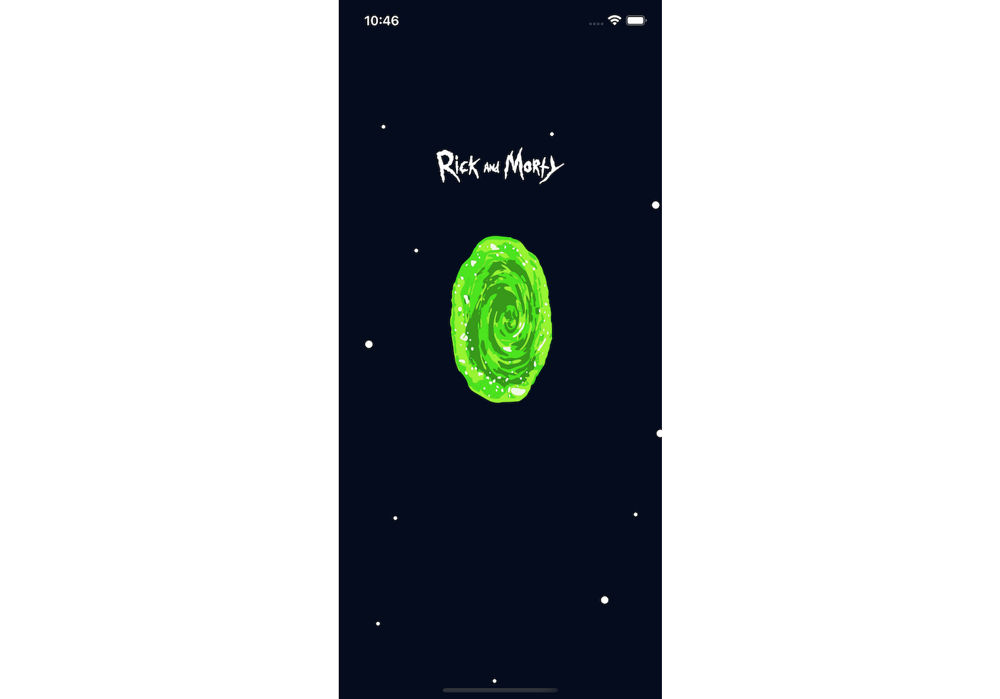
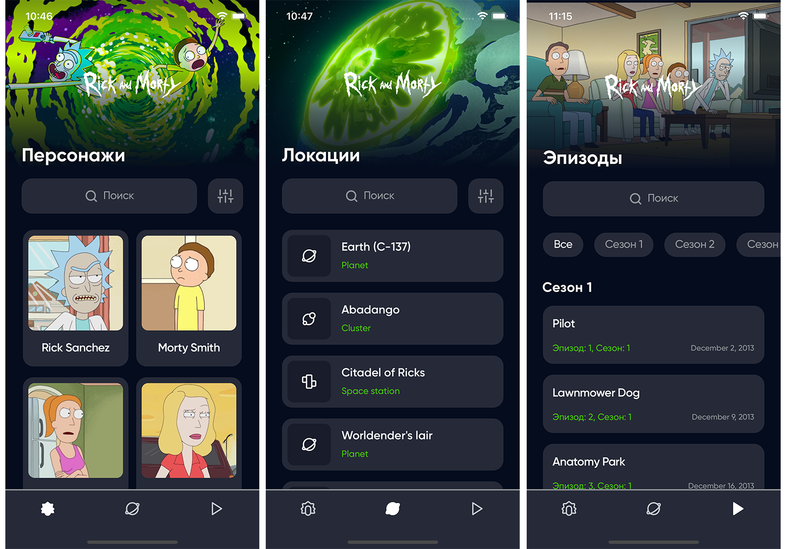
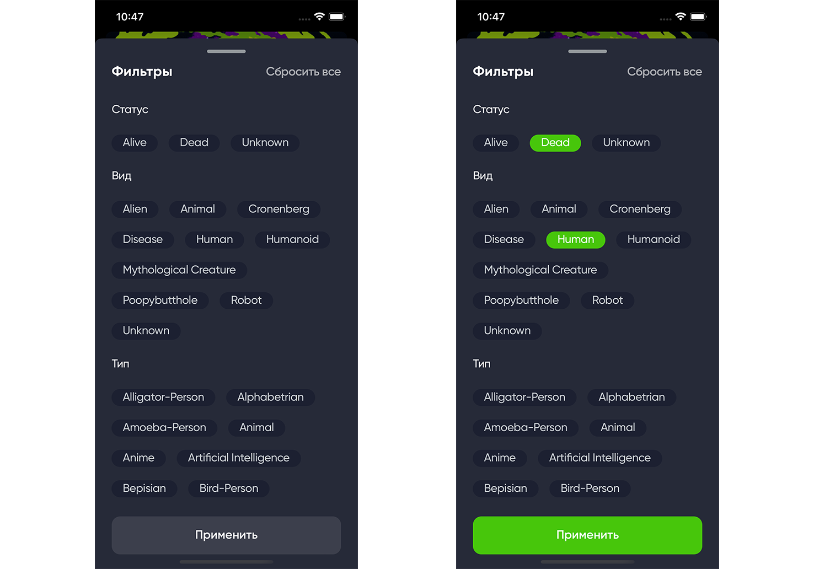
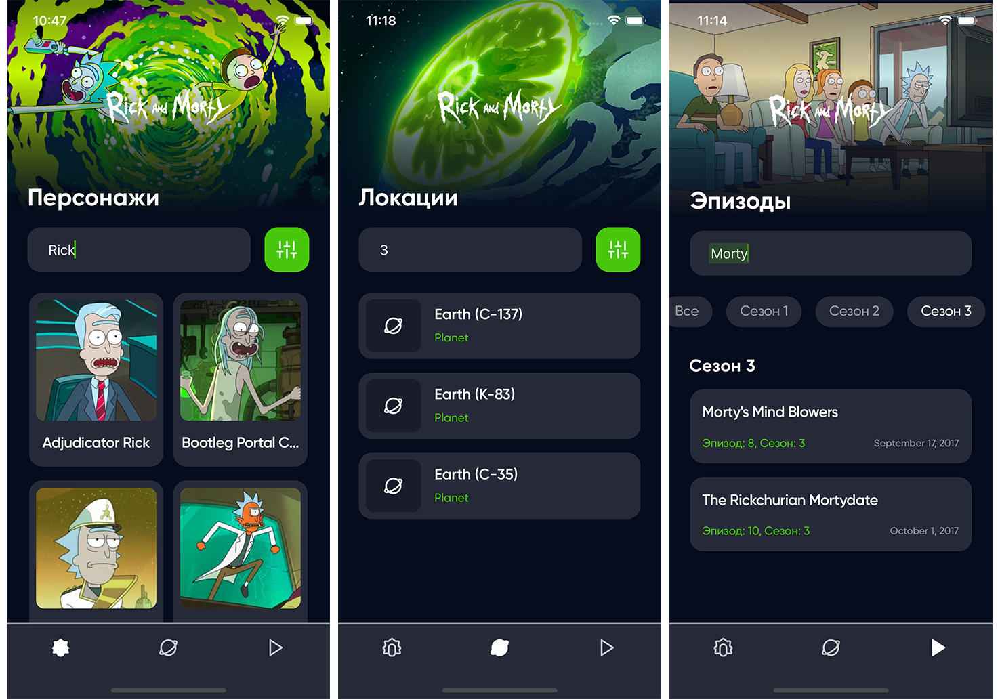
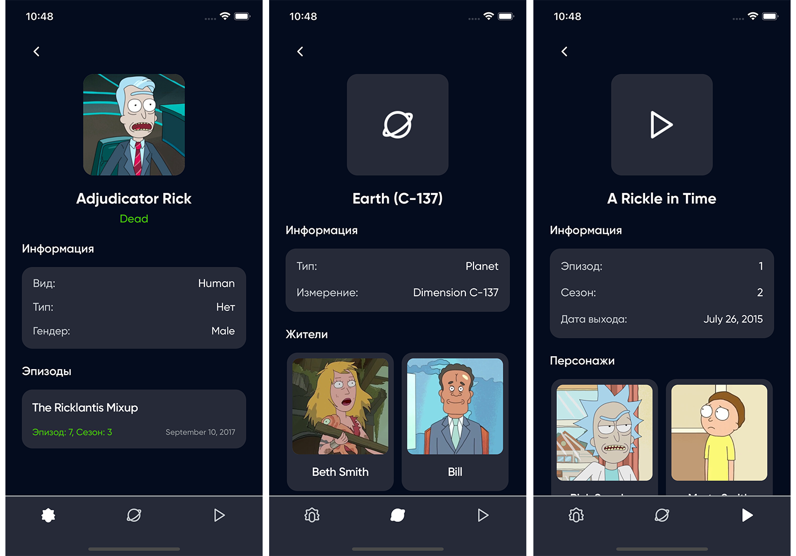

# RickAndMorty



Проект разработан в рамках стажировки по направлению IOS.  
Дизайн был подготовлен компанией Ronas IT (https://www.ronasit.com)

## Содержание

-   [Описание приложения](#описание-приложения)
-   [Запуск приложения](#запуск-приложения)
-   [Analyzing](#analyzing)
-   [Генерация сущностей](#генерация-сущностей)

---


## Описание приложения

### Главные экраны

В приложении есть 3 главных экрана:

-   Список персонажей
-   Список локаций
-   Список эпизодов

Описание экранов:

-   На каждом из экранов есть поле для поиска
-   На экранах **Персонажей** и **Локаций** есть кнопка открытия окна с фильтрами  
    Для экрана **Эпизодов** реализован кастомный __Горизонтальный Segmented Control__ для выбора сезона



### Экран фильтрации

-   При нажатии на кнопку фильтрации на экранах **Персонажей** и **Локаций** появляется всплывающее окно с выбором тэгов для фильтрации
-   Для персонажей есть следующие тэги:
    -   "Статус"
    -   "Вид"
    -   "Тип"
    -   "Гендер"
-   Для локаций:
    -   "Тип"
    -   "Измерение"



### Главные экраны с применением фильтров



### Экран деталей

-   При нажатии на карточку списка на каждом экране откроется экран с детальной информацией
-   Карточки на этом экране также переведут пользователя на экран с деталями (например, при нажатии на **Эпизод** на экране **"Детали Персонажа"** будет открыт экран **"Детали Эпизода"**)



---

## Запуск приложения

1. Открыть файл `RickAndMorty.xcodeproj`
2. Собрать проект (`Cmd+R` или `Product > Run` в меню XCode)

## Analyzing

1. Install [Swiftlint](https://github.com/realm/swiftlint):

    ```bash
    brew install swiftlint
    ```

2. Press `⌘+Shift+B` or select `Product > Analyze` in menu.

## Генерация сущностей

### Получение шаблонов для генерации

```bash
generamba template install
```

### Генерация Модулей

```bash
./Scripts/generamba_script.sh module %Name%
```

### Генерация Сервисов

```bash
./Scripts/generamba_script.sh service %Name%
```

### Генерация Компонентов

```bash
./Scripts/generamba_script.sh component %Name%
```

```bash
./Scripts/generamba_script.sh component %ModuleName% %Name%
```
